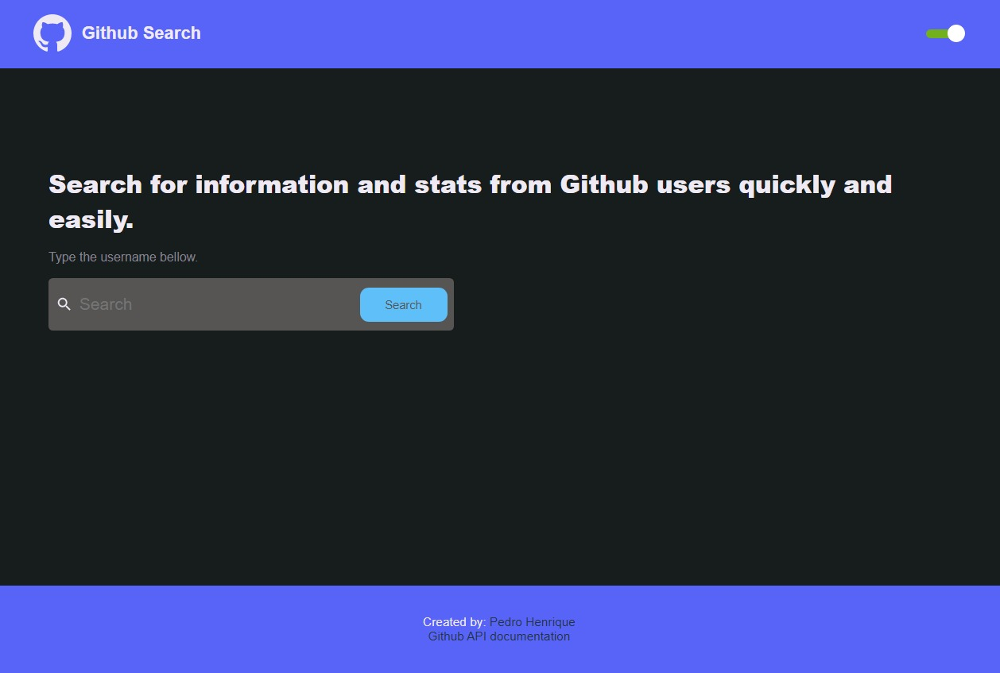
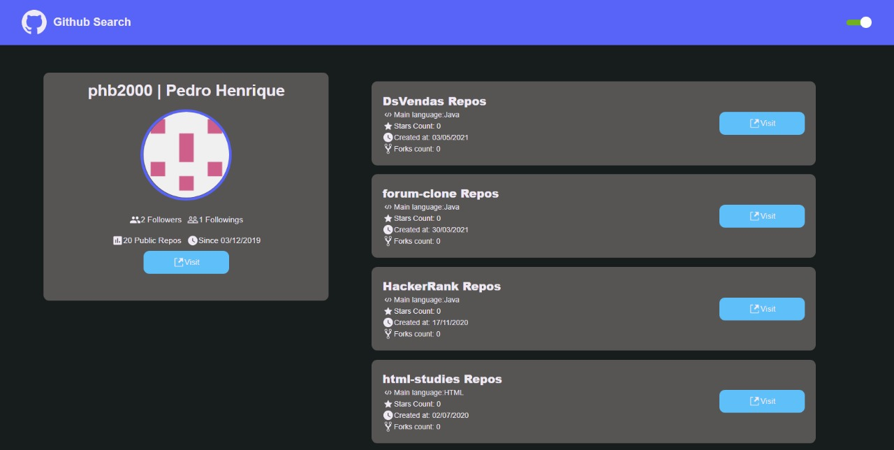

# React Github API
## :book: About
This project consists in a application search for a Github user informations, using [Github API](https://docs.github.com/en/rest).

## :rocket: Main technologies:
* [ReactJS](https://pt-br.reactjs.org/)
* [Styled Components](https://styled-components.com/)
* [Axios](https://github.com/axios/axios)
* [React Icons](https://react-icons.github.io/react-icons/)

## :computer: Layout



## :electric_plug: Running the project
To run the project you must have installed on your computer the following technologies:
* [NodeJS](https://nodejs.org/en/)
* [Yarn](https://yarnpkg.com/)
* [Git](https://git-scm.com)

```bash
  # Clone the repository.
  $ git clone https://github.com/phb2000/ReactGiHubAPI.git
  
  # Go to the project folder using cmd
  $ cd ReactGiHubAPI
  
  # Install the dependecies using the following command:
  $ yarn install
  
  # Start the application
  $ yarn start
```

Now you can access [localhost](http://localhost:3000/) and use the project.
